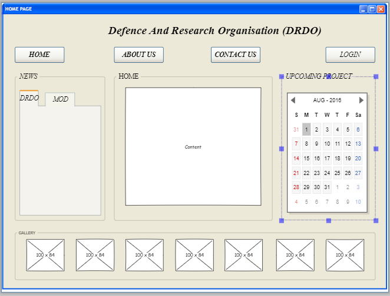

# Wire frame for a website

## AIM:
To design a wire frame for a website.

## DESIGN STEPS:

### Step 1:
Write your design steps here 

### Step 2:
Write your design steps here

## OUTPUT:

## HOMEPAGE:

## About us:

## CONTACT US:

## Result:
Thus a wire frame is designed for a given website.
